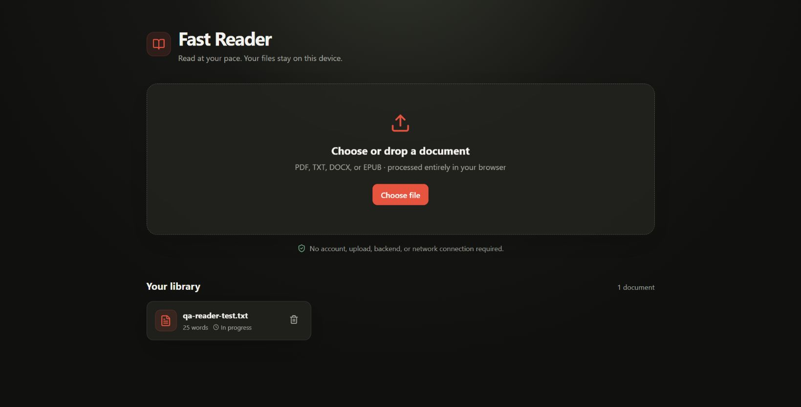
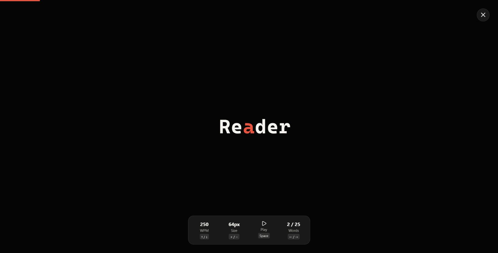

# FastReader

FastReader is a private, browser-only app for speed-reading PDF, TXT, DOCX, and EPUB documents locally.

Files are parsed on-device, saved in the browser's IndexedDB storage, and never sent to a server.





## Features

- RSVP reader with an emphasized optimal recognition point
- Adjustable reading speed (50–1,000 WPM) and text size
- Click any word in the document view to begin there
- Automatic reading-position bookmarks
- Local library stored in IndexedDB
- Keyboard controls and responsive layout
- Fully static production build; no backend, API, account, or upload service

## Run locally

Requirements: Node.js `20.19+` or `22.12+` and npm. See [REQUIREMENTS.md](REQUIREMENTS.md) for browser and platform details.

```bash
git clone <repository-url>
cd fast-reader
npm ci
npm run dev
```

Open the URL printed by Vite (normally `http://localhost:5173`). Vite only serves static app files; document processing and storage happen in the browser.

To test the production build:

```bash
npm run build
npm run preview
```

## Reader controls

| Key | Action |
| --- | --- |
| `Space` | Play or pause |
| `←` / `→` | Previous or next word |
| `↑` / `↓` | Increase or decrease WPM |
| `+` / `-` | Increase or decrease text size |
| `Esc` | Return to the document |

## Privacy and storage

The app has no application server and makes no document-related network requests. Imported text is saved to IndexedDB in the current browser profile; reading positions use `localStorage`. Removing a document deletes it from that browser. Clearing site data also clears the library and bookmarks.

## Static deployment

`npm run build` creates the static site in `dist/`. Asset URLs are relative, so it works at a domain root or project subdirectory.

For GitHub Pages, set **Settings → Pages → Build and deployment → Source** to **GitHub Actions**. The included workflow publishes `dist/` on every push to `main`.

## Supported formats

- TXT: native browser text decoding
- PDF: PDF.js text extraction (image-only/scanned PDFs require OCR and are not supported)
- DOCX: Mammoth text extraction
- EPUB: HTML/XHTML chapter extraction from the EPUB archive

Password-protected files are not supported. Very large documents are subject to browser memory and storage limits.

## Development

```bash
npm run lint
npm run build
```

The project uses React, TypeScript, and Vite. Parsing lives in `src/textExtraction.ts`; IndexedDB access is in `src/storage.ts`.

Repository checks run automatically for pushes and pull requests. See [CONTRIBUTING.md](CONTRIBUTING.md), [SECURITY.md](SECURITY.md), and [docs/ARCHITECTURE.md](docs/ARCHITECTURE.md).

## License

Licensed under the [MIT License](LICENSE).
