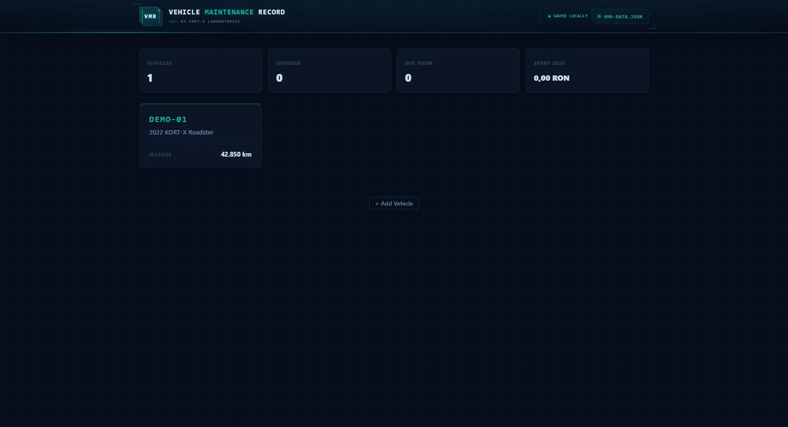

# Vehicle Maintenance Record

Vehicle Maintenance Record (VMR) is a private, local-first web app for tracking vehicles, documents, service history, fuel, mileage, costs, and upcoming maintenance. It runs on your computer, requires no account, and sends no data to a cloud service.



**Status:** Beta · **Version:** 0.2.0 · **License:** MIT

[Open the live browser demo](https://cyberkrupper.github.io/kortxprojects/vehicle-maintenance-record/VMR.html). The hosted demo uses browser storage or a user-selected JSON file; for automatic local-file saving, use the launcher described below.

## Features

- Manage multiple cars or motorcycles.
- Track documents and expiry dates.
- Record maintenance with kilometre- and month-based intervals.
- Choose a display currency and switch all stored distances between kilometres and miles.
- Log fuel purchases and full-tank consumption data.
- See overdue items, upcoming work, and annual expenses at a glance.
- Import and export portable JSON backups.
- Store data in a local `vmr-data.json` file when using the launcher.

## Quick start on Windows

1. Install [Node.js](https://nodejs.org/) 18 or newer (see [requirements](REQUIREMENTS.md)).
2. Download or clone this repository and open `vehicle-maintenance-record`.
3. Double-click `OPEN_VMR.bat` inside that directory.
4. Keep the terminal window open while using VMR.

On first use, VMR prompts you to create or select a private `vmr-data.json`. Every later change is saved to the linked file. It is excluded from Git so vehicle details are not uploaded accidentally.

You can also launch it from a terminal:

```powershell
npm.cmd start
```

## Linux and macOS setup and launch

There are no packages to install after Node.js is available:

```bash
git clone https://github.com/cyberkrupper/kortxprojects.git
cd kortxprojects/vehicle-maintenance-record
node --version
npm run check
chmod +x vmr-launcher.sh
./vmr-launcher.sh
```

The launcher opens VMR in your default browser. If automatic browser opening is unavailable, it prints the local URL to open manually. Run `./vmr-launcher.sh --no-open` when you only want the URL. See [REQUIREMENTS.md](REQUIREMENTS.md) for installation checks and platform notes.

## Browser-only use

Open `VMR.html` directly in a modern browser. VMR will ask you to select or create a JSON data file. If the browser does not support direct file linking, VMR stores its working copy in browser storage and lets you import or export backups manually.

For the most reliable automatic saving, use `OPEN_VMR.bat` or `npm start`.

## Data and privacy

All data stays on your device. The application has no analytics, advertising, remote API, or runtime dependency. Your data may include sensitive values such as registration numbers, VINs, mileage, and costs; do not commit `vmr-data.json` to a public repository.

Back up the data regularly using the app's data-file menu. See the [user guide](docs/USER_GUIDE.md) for usage, backup, restore, and troubleshooting instructions.

## Currency and distance settings

Open **Settings** in the header to choose a currency or distance unit. Currency changes affect symbols and labels only; saved monetary amounts are never converted. Switching between kilometres and miles converts vehicle odometers, service readings, service intervals, and fuel-log distances using the standard `1 mi = 1.609344 km` conversion.

## Development

The interface is contained in `VMR.html`; `vmr-launcher.js` provides a small local HTTP server and safe JSON persistence. The stack is HTML, CSS, vanilla JavaScript, and Node.js. No build step or package installation is required.

```powershell
npm.cmd run check
npm.cmd run start:no-open
```

The server listens only on `127.0.0.1` and selects an available port. Press `Ctrl+C` to stop it.

## Contributing and security

Contributions are welcome; read [CONTRIBUTING.md](CONTRIBUTING.md) before opening a pull request. Please report security concerns according to [SECURITY.md](SECURITY.md), not in a public issue.

Repository owners can follow the [release guide](docs/RELEASING.md) when publishing a version.

## License

Released under the [MIT License](LICENSE). Copyright (c) 2026 KORT-X Laboratories.
