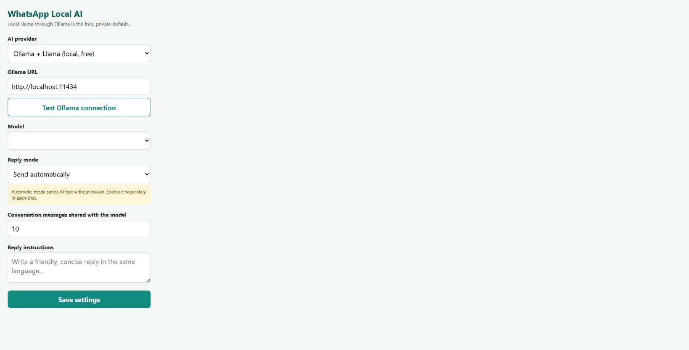

# WhatsApp Local AI Autopilot

A Chrome Manifest V3 extension that drafts or sends replies in WhatsApp Web using a local Llama model through [Ollama](https://ollama.com). The default configuration runs entirely on your computer, requires no API key, and has no per-message API fee.

Current version: **3.0.1**.

## Documentation

- [System and software requirements](docs/REQUIREMENTS.md)
- [Download, installation, upgrade, test, and uninstall guide](docs/INSTALLATION.md)
- [Privacy policy](PRIVACY.md)
- [Security policy](SECURITY.md)
- [Contributing](CONTRIBUTING.md)
- [Changelog](CHANGELOG.md)
- [Third-party notices](THIRD_PARTY_NOTICES.md)

> [!WARNING]
> This is an unofficial community project. It is not affiliated with WhatsApp, Meta, Ollama, or model vendors. WhatsApp Web can change without notice, and automated messaging may violate WhatsApp rules or local law. Use automatic sending carefully and never for spam.

## Screenshot

[](docs/images/settings-popup.jpg)

## What changed in v3

- Ollama + `llama3.2:1b` is now the free, low-requirement default.
- Automatic send is the default; it remains opt-in separately for each chat and can be changed to draft mode.
- A generated reply is discarded if you switch chats while the model is working.
- The extension performs only one send action, preventing the old click-plus-Enter duplicate risk.
- Custom API domains require an explicit Chrome permission prompt.
- API keys are separated by provider and stay in Chrome local extension storage.
- Unused broad permissions, heartbeat alarms, cloud-only model entries, hard-coded extension IDs, and destructive helper scripts were removed.

## Requirements summary

| Component | Minimum or supported baseline |
| --- | --- |
| Browser | Current Google Chrome or Chromium browser with Manifest V3 and developer mode |
| Web app | An active WhatsApp account signed in at `https://web.whatsapp.com` |
| Local AI runtime | Ollama on Windows 10 22H2+, macOS 14 Sonoma+, or a supported Linux distribution |
| Model | `llama3.2:1b`, approximately 1.3 GB |
| Memory | 8 GB system RAM recommended for Chrome, WhatsApp Web, and the local 1B model together |
| Disk | On Windows, allow at least 6 GB free for Ollama plus this model; more for updates or larger models |
| Development only | Node.js 18+ and Git |

A dedicated GPU is **not required** for the 1B model; CPU inference is supported but may be slower. Hardware needs vary by operating system, context size, and concurrent applications. See [the complete requirements guide](docs/REQUIREMENTS.md) before installing.

## Downloads

- **Extension:** use the GitHub repository's **Code → Download ZIP**, or clone it with Git. Extract the ZIP before choosing **Load unpacked** in Chrome.
- **Ollama:** use the [official Ollama download page](https://ollama.com/download) for Windows, macOS, or Linux.
- **Default Llama model:** the setup script or `ollama pull llama3.2:1b` downloads it from the [official Ollama Llama 3.2 library](https://ollama.com/library/llama3.2).

Do not download model blobs from this GitHub repository. The local `ollama-models/` directory is intentionally excluded from Git because it is about 1.3 GB and is generated by Ollama.

## Quick start: Windows

1. Install Ollama.
2. On Windows, open PowerShell in this repository and run:

   ```powershell
   .\setup-ollama.ps1
   ```

   The script allows Chrome extension origins, stores models in the ignored `ollama-models` folder, starts Ollama, and downloads `llama3.2:1b`.

3. Open `chrome://extensions`, turn on **Developer mode**, choose **Load unpacked**, and select this repository folder.
4. Open the extension popup. Keep **Ollama + Llama**, click **Test Ollama connection**, and save.
5. Open [WhatsApp Web](https://web.whatsapp.com), select a conversation, and click **AI: OFF** near the message box to enable it for that chat.
6. New incoming messages are sent automatically by default. Use **Create a draft for review** in settings when you want manual approval.

For better quality on a computer with more memory, select `llama3.2:3b` and run:

```powershell
.\setup-ollama.ps1 -Model llama3.2:3b
```

For macOS, Linux, manual Windows setup, upgrades, verification, and removal, follow [docs/INSTALLATION.md](docs/INSTALLATION.md).

## Optional providers

The popup also supports Gemini, OpenAI, and OpenAI-compatible `/chat/completions` APIs. These providers may have fees, quotas, data-retention rules, and separate terms. Conversation context is sent to the selected provider when one of these options is enabled. Never put API keys in source files.

## How it behaves

- AI is enabled separately for each chat and remains off until confirmed.
- Enabling AI ignores the message already visible; only a later incoming message triggers a reply.
- At most 30 recent text messages are used as context.
- Media, voice notes, reactions, and quoted-message structure are not interpreted.
- If the composer already contains text, the extension leaves it untouched.
- If WhatsApp selectors change, the extension reports an error and leaves the reply unsent.

## Development

No build step or third-party package is required. Run the checks with Node.js 18 or newer:

```sh
npm test
```

Then reload the unpacked extension from `chrome://extensions`. GitHub Actions runs the same checks on pushes and pull requests.

There are no npm runtime dependencies and no build step. Do not add `ollama-models/`, API keys, private chats, generated archives, or browser-profile data to commits.

## Troubleshooting

**Ollama connection failed**

- Confirm `ollama` is running and `http://localhost:11434/api/tags` responds.
- Restart Ollama after setting `OLLAMA_ORIGINS=chrome-extension://*`.
- On Windows, rerun `setup-ollama.ps1`.

**Model is not installed**

Run `ollama pull llama3.2:1b`, or choose the exact name of a model shown by `ollama list`.

**No AI button appears**

Refresh WhatsApp Web after loading or updating the extension. WhatsApp may have changed its page structure; please open an issue with browser and extension versions, but do not include chat content or API keys.

## Privacy and security

See [PRIVACY.md](PRIVACY.md) and [SECURITY.md](SECURITY.md). Local Ollama processing keeps prompt traffic on the configured Ollama host. This project does not add analytics or a remote server.

## License

[MIT](LICENSE) for this extension's source code. Llama models, WhatsApp, Ollama, Chrome, and optional API services remain subject to their owners' terms; see [THIRD_PARTY_NOTICES.md](THIRD_PARTY_NOTICES.md).
